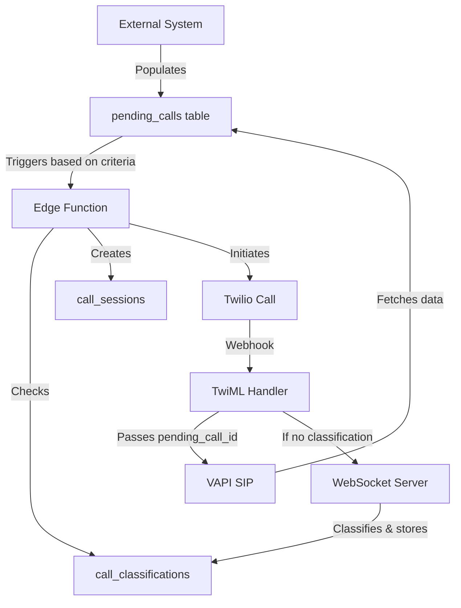

# Pending Calls to VAPI Integration - Technical Architecture

## Overview

This document describes the technical architecture for integrating pending calls with VAPI through a pre-classification system. The system enables automated outbound calls to clinics with intelligent IVR navigation and human detection capabilities.

## System Flow



## Database Architecture

### Table Relationships

```
pending_calls (1) ────────────→ (many) call_sessions
     │                                       │
     └──→ (0..1) call_classifications ←──────┘
              (pre-check)              (classification)
```

### Key Tables

#### 1. **pending_calls**
- **Purpose**: Stores exam/appointment data from external systems
- **Key Fields**:
  - `id` (UUID) - Primary key
  - `exam_id` - External reference
  - `employee_name`, `employee_dob` - Patient info
  - `client_name` - Employer/client
  - `phone` - Clinic phone number
  - `appointment_time` - When the appointment is scheduled
  - `call_status` - Current status of the call attempt
  - `classification_id` - Pre-checked classification (if exists)
  - Various instruction fields for VAPI to use

#### 2. **call_sessions**
- **Purpose**: Tracks individual call attempts for each pending call
- **Key Fields**:
  - `id` (UUID) - Session ID
  - `call_id` - Twilio Call SID
  - `pending_call_id` - Links to pending_calls (FK)
  - `classification_id` - Classification used for this session
  - `call_status` - Status of this specific attempt
  - IVR detection fields

#### 3. **call_classifications**
- **Purpose**: Caches clinic phone system classifications (human/IVR)
- **Key Fields**:
  - `phone_number` - The clinic's phone number
  - `classification_type` - 'human', 'ivr_only', 'ivr_then_human'
  - `ivr_actions` - Stored IVR navigation steps with timing
  - `classification_expires_at` - 30-day cache expiration

## Data Flow

### 1. **Pending Call Creation**
```sql
-- External system inserts new pending call
INSERT INTO pending_calls (
  exam_id, employee_name, phone, appointment_time, ...
) VALUES (...);
```

### 2. **Edge Function Triggered**
```typescript
// Triggered by pending_calls meeting criteria (e.g., today's appointments)
const pendingCall = await supabase
  .from('pending_calls')
  .select('*')
  .eq('id', pending_call_id)
  .single();
```

### 3. **Classification Check**
```typescript
// Check if we already know this clinic's phone system
const classification = await supabase
  .from('call_classifications')
  .select('*')
  .eq('phone_number', pendingCall.phone)
  .eq('is_active', true)
  .gte('classification_expires_at', new Date().toISOString())
  .single();
```

### 4. **Session Creation**
```typescript
// Create a new call session for this attempt
const session = await supabase
  .from('call_sessions')
  .insert({
    id: sessionId,
    pending_call_id: pendingCall.id,
    classification_id: classification?.id,
    call_status: 'initiating'
  });
```

### 5. **VAPI Data Retrieval**
When VAPI receives the call, it only gets a single `pending_call_id` via SIP header:
```javascript
// VAPI receives: X-pendingcallid=abc123

// VAPI fetches all data:
const pendingCall = await supabase
  .from('pending_calls')
  .select('*')
  .eq('id', pendingCallId)
  .single();

// Now VAPI has access to:
// - employee_name, employee_dob
// - appointment_time, procedures
// - all instructions and context
```

## Benefits of This Architecture

### 1. **Single Source of Truth**
- All call data lives in `pending_calls`
- No data duplication or synchronization issues
- VAPI always gets the latest data

### 2. **Multiple Attempt Tracking**
- Each retry creates a new `call_session`
- Complete audit trail of all attempts
- Can analyze success/failure patterns

### 3. **Efficient Classification**
- Classifications cached for 30 days
- Reduces classification overhead by 94%
- Instant routing for known clinics

### 4. **Scalability**
- Simple ID passing (no complex data in headers)
- Supports unlimited data fields in `pending_calls`
- Easy to add new fields without changing integration

### 5. **Status Management**
```sql
-- Track call lifecycle
UPDATE pending_calls 
SET call_status = 'calling'
WHERE id = ?;

-- View all attempts
SELECT * FROM call_sessions 
WHERE pending_call_id = ?
ORDER BY created_at DESC;

-- Success metrics
SELECT 
  COUNT(*) as total_calls,
  SUM(CASE WHEN call_status = 'completed' THEN 1 ELSE 0 END) as successful
FROM pending_calls
WHERE appointment_time::date = CURRENT_DATE;
```

## Implementation Checklist

- [ ] Add `pending_call_id` column to `call_sessions` table
- [ ] Remove `call_session_id` from `pending_calls` table
- [ ] Update Edge Function to accept `pending_call_id` as input
- [ ] Modify TwiML handler to pass `pending_call_id` to VAPI
- [ ] Configure VAPI to fetch data using `pending_call_id`
- [ ] Set up monitoring for call success rates
- [ ] Create indexes for performance optimization

## Security Considerations

1. **Data Access**: VAPI should only have read access to `pending_calls`
2. **ID Validation**: Always validate `pending_call_id` exists before processing
3. **Rate Limiting**: Implement limits on retry attempts per `pending_call`
4. **PII Protection**: Ensure patient data is encrypted at rest and in transit

## Future Enhancements

1. **Automatic Retries**: Implement logic to retry failed calls
2. **Smart Scheduling**: Call at optimal times based on clinic patterns
3. **Result Storage**: Store call outcomes back to `pending_calls`
4. **Analytics Dashboard**: Track success rates by clinic, time of day, etc.
