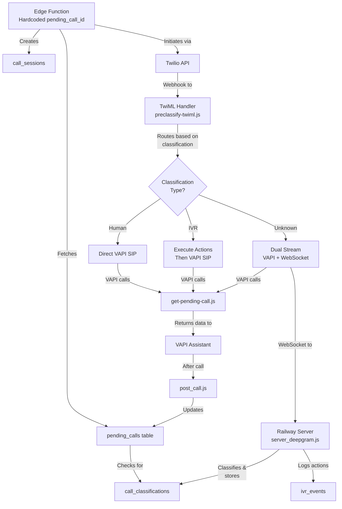

# Pending Calls to VAPI Integration - Technical Architecture (Updated)

## Overview

This document describes the current technical architecture for integrating pending calls with VAPI through a pre-classification system. The system enables automated outbound calls to clinics with intelligent IVR navigation and human detection capabilities.

## Current Implementation Status

**Key Change**: The system currently uses a **hardcoded pending_call_id** in the edge function for testing purposes, rather than being triggered dynamically by external systems.

## System Flow



## Data Flow Architecture

### 1. **Call Initiation (Edge Function)**
```typescript
// Current implementation with hardcoded ID
const HARDCODED_PENDING_CALL_ID = "0e9f4fc4-619a-40c2-b40a-05e8da6dbe8c";

// Flow:
1. Fetch pending call by hardcoded ID
2. Check for existing classification
3. Create call session with:
   - pending_call_id reference
   - clinic_phone
   - classification_id (if exists)
4. Pass parameters to TwiML via URL query
```

### 2. **TwiML Routing Logic**
```javascript
// URL parameters received:
- sessionId: UUID of call session
- pendingCallId: Reference to pending call
- hasClassification: Boolean flag

// SIP header construction:
customHeaders = {
  'pendingcallid': pendingCallId,
  'sessionid': sessionId,
  'employee_name': data.employee_name,
  'employee_dob': readableDate(data.employee_dob),
  'appointment_time': readableDateTime(data.appointment_time),
  'classification': classificationType || 'unknown'
}
```

### 3. **VAPI Data Retrieval**
```javascript
// VAPI receives only the pending_call_id
// Calls GET /api/twilio/get-pending-call?id={pending_call_id}

// Security: Requires x-vapi-shared-secret header
// Returns: Complete pending call record with all fields
```

### 4. **WebSocket Classification & Navigation**
```javascript
// Real-time processing flow:
1. Receive Twilio audio stream
2. Forward to Deepgram for transcription
3. Process transcripts for:
   - Fast pattern matching
   - IVR menu navigation
   - OpenAI classification
4. Store classification with timing
5. Log IVR navigation events
```

## Key Implementation Details

### SIP Header Encoding
The system properly handles special characters in SIP URIs:
```javascript
function buildSipUriWithHeaders(baseUri, headers) {
  const params = new URLSearchParams();
  for (const [key, value] of Object.entries(headers)) {
    params.append(`X-${key}`, value);
  }
  // Critical: Replace & with &amp; for XML
  const queryString = params.toString().replace(/&/g, '&amp;');
  return `${baseUri}?${queryString}`;
}
```

### IVR Action Timing
Actions are stored with millisecond precision from call start:
```javascript
// During call (WebSocket server)
const callStartTime = new Date(session.created_at).getTime();
const actionTime = new Date(event.created_at).getTime();
const timing_ms = actionTime - callStartTime;

// During playback (TwiML)
const pauseSeconds = Math.ceil(timing_ms / 1000);
twiml += `<Pause length="${pauseSeconds}" />`;
```

### Classification Storage Logic
Classifications are stored differently based on type:

**Human**: Stored immediately upon detection
```javascript
if (classification === 'human') {
  await storeClassification(session, classification, latencyMs, confidence);
}
```

**IVR**: Stored at call end with complete action sequence
```javascript
if (data.event === 'stop') {
  await storeFinalClassification(streamSid);
}
```

### Date Formatting for VAPI
Employee data is formatted for natural speech:
```javascript
// DOB: "January 15, 1985"
const readableDob = new Intl.DateTimeFormat('en-US', {
  year: 'numeric',
  month: 'long',
  day: 'numeric'
}).format(new Date(data.employee_dob));

// Appointment: "March 22, 2024 at 2:30 PM"
const readableAppt = new Intl.DateTimeFormat('en-US', {
  year: 'numeric',
  month: 'long',
  day: 'numeric',
  hour: 'numeric',
  minute: '2-digit',
  hour12: true
}).format(new Date(data.appointment_time));
```

## Database Relationships

```
pending_calls (1) ────────────→ (many) call_sessions
     │                                       │
     │                                       ├──→ call_classifications
     │                                       │         (via classification_id)
     │                                       │
     └──────────────────────────────────────┴──→ ivr_events
                                                  (via call_id)
```

## Current Limitations & TODOs

### In Current Implementation:
- ✅ Hardcoded pending_call_id for testing
- ✅ Full flow from initiation to VAPI to result storage
- ✅ IVR classification and navigation
- ✅ Human-readable date formatting
- ✅ Secure VAPI data endpoint

### TODO for Production:
- [ ] Remove hardcoded pending_call_id
- [ ] Implement dynamic triggering (cron job, webhook, or queue)
- [ ] Add retry logic for failed calls
- [ ] Implement call scheduling based on clinic hours
- [ ] Add monitoring and alerting
- [ ] Rate limiting per clinic
- [ ] Bulk call processing

## API Endpoints

### 1. **Edge Function**
```
POST /functions/v1/pre-classify-call
Authorization: Bearer {SUPABASE_ANON_KEY}

Response:
{
  "success": true,
  "result": { ...twilioResponse },
  "pending_call_id": "...",
  "phone_number": "+1234567890",
  "classification_found": true,
  "classification_type": "human"
}
```

### 2. **TwiML Handler**
```
POST /api/twilio/preclassify-twiml
Query params: sessionId, pendingCallId, hasClassification

Returns: TwiML XML for call routing
```

### 3. **VAPI Data Endpoint**
```
GET /api/twilio/get-pending-call?id={pending_call_id}
Headers: x-vapi-shared-secret: {secret}

Response: Complete pending_call record
```

### 4. **VAPI Webhook**
```
POST /api/vapi/post_call
Authorization: Bearer {VAPI_SECRET_TOKEN}

Body: VAPI call analysis results
Updates: summary, success_evaluation, structured_data
```

## Security Model

1. **Edge Function**: Requires Supabase auth
2. **TwiML Handler**: Validated by Twilio signature (implicit)
3. **VAPI Data**: Shared secret authentication
4. **VAPI Webhook**: Bearer token authentication
5. **WebSocket**: No additional auth (trusted network)

## Performance Considerations

### Classification Caching
- 30-day cache per phone number
- Reduces classification overhead by ~94%
- Instant routing for known clinics

### Connection Pooling
- WebSocket connections kept alive for 30s
- Reduces reconnection overhead
- Maintains transcription state

### Database Indexes
Ensure these indexes exist:
```sql
CREATE INDEX idx_call_sessions_pending_call_id ON call_sessions(pending_call_id);
CREATE INDEX idx_call_sessions_call_id ON call_sessions(call_id);
CREATE INDEX idx_call_classifications_phone ON call_classifications(phone_number);
CREATE INDEX idx_ivr_events_call_id ON ivr_events(call_id);
CREATE INDEX idx_pending_calls_phone ON pending_calls(phone);
```

## Monitoring Queries

### Active Calls
```sql
SELECT 
  pc.employee_name,
  pc.appointment_time,
  cs.call_status,
  cs.ivr_detection_state,
  NOW() - cs.created_at as duration
FROM call_sessions cs
JOIN pending_calls pc ON cs.pending_call_id = pc.id
WHERE cs.call_status = 'active'
ORDER BY cs.created_at DESC;
```

### Classification Performance
```sql
SELECT 
  classification_type,
  COUNT(*) as count,
  AVG(classification_duration_ms) as avg_duration_ms,
  AVG(classification_confidence) as avg_confidence
FROM call_classifications
WHERE created_at > NOW() - INTERVAL '7 days'
GROUP BY classification_type;
```

### Call Success Rate
```sql
SELECT 
  DATE(pc.created_at) as date,
  COUNT(*) as total_calls,
  SUM(CASE WHEN pc.success_evaluation = true THEN 1 ELSE 0 END) as successful,
  ROUND(100.0 * SUM(CASE WHEN pc.success_evaluation = true THEN 1 ELSE 0 END) / COUNT(*), 2) as success_rate
FROM pending_calls pc
WHERE pc.trigger_attempted_at IS NOT NULL
GROUP BY DATE(pc.created_at)
ORDER BY date DESC
LIMIT 30;
```
