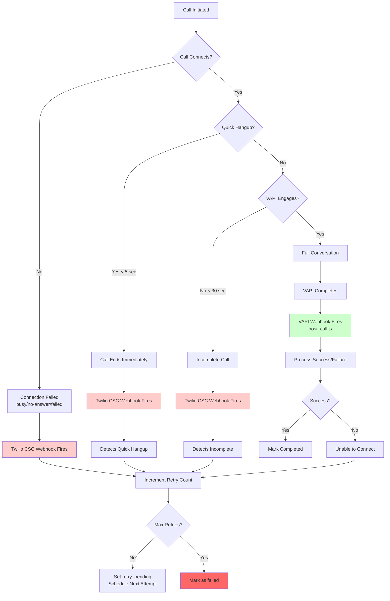

# Technical Architecture & Database Tables
*Last Updated: 08-19-2025*

## System Overview
A comprehensive IVR classification and call handling system that pre-classifies clinic phone systems (human vs IVR vs voicemail) and caches results for 30 days, enabling instant routing for subsequent calls with automated workflow management and robust retry handling.

## Architecture Diagram

````mermaid
graph TD
    %% Scheduler Flow
    CRON[pg_cron<br/>Every minute] -->|Triggers| SCHED[Edge Function<br/>scheduler]
    SCHED -->|Check orphans| ORPHAN{Stuck > 5min?}
    ORPHAN -->|Yes| RETRY_INC[Increment Retry<br/>Set retry_pending or failed]
    ORPHAN -->|No| PC[pending_calls table<br/>workflow_state management]
    SCHED -->|Queries| PC
    SCHED -->|Processes states| WF{Workflow<br/>State?}
    
    WF -->|new| CHECK[Check for existing<br/>classification]
    WF -->|classification_pending| TASK[Trigger task call]
    WF -->|ready_to_call| TASK
    WF -->|retry_pending| RETRY[Check retry count<br/>& trigger or fail]
    
    CHECK -->|Found| READY[Set ready_to_call]
    CHECK -->|Not found| CLASSIFY[Set needs_classification]
    
    CLASSIFY -->|Triggers| PRE[Edge Function<br/>pre-classify-call-07-21-2025]
    READY -->|Triggers| PRE
    TASK -->|Triggers| PRE
    RETRY -->|Under max| PRE
    RETRY -->|At max| FAIL[Mark as failed]
    
    %% Main Call Flow
    PRE -->|Fetches| PC
    PRE -->|Checks for| CC[call_classifications<br/>30-day cache]
    PRE -->|Creates| CS[call_sessions<br/>with workflow_metadata]
    PRE -->|Initiates via| TW[Twilio API<br/>+ Status Callback]
    
    TW -->|Webhook to| TWIML[TwiML Handler<br/>preclassify-twiml.js]
    TW -->|On completion| CSC[call-status-complete.js<br/>Disconnect Detection]
    
    TWIML -->|Routes based on<br/>classification| RT{Classification<br/>Type?}
    
    RT -->|Human| HUMAN[Direct VAPI SIP]
    RT -->|IVR_only| IVR[Execute Actions<br/>with timing → VAPI]
    RT -->|IVR_then_human| TRANS[Wait for transfer<br/>timing → VAPI]
    RT -->|Unknown| DUAL[Dual Stream<br/>VAPI + WebSocket]
    
    %% VAPI Flow
    HUMAN -->|VAPI calls| GET[get-pending-call.js]
    IVR -->|VAPI calls| GET
    TRANS -->|VAPI calls| GET
    DUAL -->|VAPI calls| GET
    
    %% WebSocket Classification
    DUAL -->|WebSocket to| WS[Railway Server<br/>server_deepgram.js]
    WS -->|Real-time<br/>classification| CLS{Detection<br/>Type?}
    
    CLS -->|Human/IVR| STORE[Store classification<br/>& IVR actions]
    CLS -->|Voicemail| SKIP[Skip classification<br/>Increment retry<br/>Set retry_pending]
    CLS -->|IVR_then_human| TRANSFER[Capture transfer<br/>timing]
    
    STORE -->|Updates| CC
    STORE -->|Updates| CS
    TRANSFER -->|Stores timing| EVT[ivr_events table]
    SKIP -->|Updates| CS
    SKIP -->|Increments| PC
    
    %% VAPI Completion
    GET -->|Returns data to| VAPI[VAPI Assistant]
    VAPI -->|After call| POST[post_call.js]
    POST -->|Updates latest state| PC
    POST -->|Preserves history| CS
    
    %% Disconnect Detection
    CSC -->|Quick hangup<br/>or failed| DISC{Disconnect<br/>Type?}
    DISC -->|< 5 sec| QUICK[Quick Hangup]
    DISC -->|Failed/Busy| CONN[Connection Failed]
    DISC -->|< 30 sec| INCOMP[Incomplete]
    
    QUICK -->|Increment retry| PC
    CONN -->|Increment retry| PC
    INCOMP -->|Increment retry| PC
    
    %% Status Updates
    POST -->|Sets workflow_state| STATUS{Success<br/>Evaluation?}
    STATUS -->|Sending Records| COMP[completed]
    STATUS -->|No Show| COMP
    STATUS -->|Unable to connect| PEND[retry_pending<br/>or failed]
    
    COMP -->|Terminal state| END[End]
    PEND -->|Under max retries| CRON
    PEND -->|At max retries| FAIL2[failed]
    
    %% Styling
    classDef scheduler fill:#e1f5fe,stroke:#01579b,stroke-width:2px
    classDef edge fill:#fff3e0,stroke:#e65100,stroke-width:2px
    classDef storage fill:#f3e5f5,stroke:#4a148c,stroke-width:2px
    classDef external fill:#e8f5e9,stroke:#1b5e20,stroke-width:2px
    classDef decision fill:#fce4ec,stroke:#880e4f,stroke-width:2px
    classDef webhook fill:#fff9c4,stroke:#f57f17,stroke-width:2px
    classDef failed fill:#ffebee,stroke:#c62828,stroke-width:2px
    
    class CRON,SCHED scheduler
    class PRE,GET,POST,CSC edge
    class PC,CS,CC,EVT storage
    class TW,VAPI,WS external
    class WF,RT,CLS,STATUS,DISC,ORPHAN decision
    class TWIML webhook
    class FAIL,FAIL2 failed
````

## Webhook Architecture

### Dual Webhook System for Comprehensive Retry Management



## Core Components

### 1. Edge Functions (Supabase)
- **`pre-classify-call-07-21-2025`**: Initiates calls with dynamic pending_call_id support
- **`scheduler`**: Orchestrates workflow states, triggers calls every minute, handles orphaned calls

### 2. API Endpoints (Vercel)
- **`api/twilio/preclassify-twiml.js`**: Routes calls based on classification
- **`api/twilio/get-pending-call.js`**: Provides call data to VAPI
- **`api/vapi/post_call.js`**: Receives call results, updates both pending_calls and call_sessions
- **`api/twilio/call-status-complete.js`**: NEW - Handles disconnects and quick hangups

### 3. WebSocket Server (Railway)
- **`server_deepgram.js`**: Real-time classification, IVR navigation, transfer timing capture
- Key modules:
  - `ivr-navigator.js`: OpenAI-powered IVR menu navigation
  - `fast-classifier.js`: Pattern matching including voicemail detection
  - `openai-classifier.js`: AI classification for complex cases
  - `supabase-logger.js`: Stores classifications and manages call state

### 4. Automated Scheduler (pg_cron)
- Runs every minute via pg_cron
- Detects and handles orphaned calls (stuck > 5 minutes)
- Processes pending calls through workflow states
- Handles retries with exponential backoff
- Manages two-call flow for IVR systems
- Properly transitions to 'failed' after max retries

## Database Schema

### 1. pending_calls Table
Manages the workflow lifecycle of each call attempt with enhanced retry tracking.

```sql
CREATE TABLE pending_calls (
  -- Core fields
  id UUID PRIMARY KEY,
  exam_id TEXT NOT NULL,
  employee_name TEXT NOT NULL,
  employee_dob DATE,
  client_name TEXT,
  appointment_time TIMESTAMPTZ NOT NULL,
  type_of_visit TEXT,
  phone TEXT NOT NULL,
  clinic_name TEXT,
  clinic_provider_address TEXT,
  clinic_scheduling_rep TEXT,
  procedures TEXT,
  procedure_instructions TEXT,
  kit_materials TEXT,
  kit_sending_method TEXT,
  exam_instructions TEXT,
  medical_personnel_instructions TEXT,
  
  -- Workflow management (ENHANCED)
  workflow_state TEXT DEFAULT 'new',
  classification_id UUID REFERENCES call_classifications(id),
  classification_type TEXT,
  classification_lookup_at TIMESTAMPTZ,
  classification_checked_at TIMESTAMPTZ,
  retry_count INT DEFAULT 0,              -- Properly incremented on all failures
  max_retries INT DEFAULT 3,              -- Configurable retry limit
  next_action_at TIMESTAMPTZ DEFAULT NOW(),
  last_error TEXT,                        -- Tracks disconnect reasons
  last_attempt_at TIMESTAMPTZ,            -- When last call was attempted
  workflow_metadata JSONB DEFAULT '{}',   -- Latest state only
  
  -- Call execution
  triggered BOOLEAN DEFAULT false,
  trigger_attempted_at TIMESTAMPTZ,
  trigger_response JSONB,
  call_status TEXT DEFAULT 'pending',
  vapi_call_id TEXT,
  
  -- Call results (overwritten with latest attempt)
  summary TEXT,
  success_evaluation TEXT,
  structured_data JSONB,
  
  -- Timestamps
  created_at TIMESTAMPTZ DEFAULT NOW(),
  updated_at TIMESTAMPTZ DEFAULT NOW()    -- Critical for orphan detection
);
```

**workflow_metadata structure (latest state only)**:
```json
{
  "classification_type": "human|ivr_only|ivr_then_human",
  "classification_found": true,
  "last_attempt_result": "voicemail|quick_hangup|connection_failed|incomplete",
  "voicemail_detected_at": "2025-08-19T15:00:00Z",
  "voicemail_count": 2,
  "disconnect_detected_at": "2025-08-19T15:01:00Z",
  "orphaned_at": "2025-08-19T15:05:00Z",
  "orphaned_from_state": "calling",
  "vapi_completed_at": "2025-08-19T15:05:00Z",
  "vapi_success_evaluation": "Sending Records",
  "vapi_summary": "Spoke with receptionist...",
  "records_being_sent": true,
  "failed_at": "2025-08-19T16:00:00Z",
  "failure_reason": "max_retries_exceeded",
  "total_attempts": 3
}
```

### 2. call_sessions Table
Preserves complete history of every call attempt with detailed metadata.

```sql
CREATE TABLE call_sessions (
  id UUID PRIMARY KEY,
  call_id TEXT UNIQUE,                    -- Twilio Call SID
  pending_call_id UUID REFERENCES pending_calls(id),
  telnyx_leg_id TEXT,
  clinic_phone TEXT,
  clinic_name TEXT,
  classification_id UUID REFERENCES call_classifications(id),
  
  -- Call state
  call_status TEXT,                       -- active, completed, voicemail, failed
  ivr_detection_state TEXT,              -- human, ivr_only, ivr_then_human, voicemail
  ivr_classified_at TIMESTAMPTZ,
  ivr_detection_latency_ms INT4,
  ivr_confidence_score FLOAT8,
  
  -- Stream management
  stream_started BOOLEAN DEFAULT false,
  streams_initialized BOOLEAN DEFAULT false,
  first_stream_request_at TIMESTAMPTZ,
  websocket_mode BOOLEAN DEFAULT false,
  
  -- Call termination
  call_ended_by TEXT,                    -- classification_system, voicemail_detection, user, disconnect
  call_end_reason TEXT,
  ended_at TIMESTAMPTZ,
  
  -- Workflow metadata (complete history preserved)
  workflow_metadata JSONB DEFAULT '{}',
  
  -- Timestamps
  created_at TIMESTAMPTZ DEFAULT NOW(),
  updated_at TIMESTAMPTZ
);
```

**workflow_metadata structure (complete history)**:
```json
{
  // Classification data
  "classification_stored_at": "2025-08-19T15:00:00Z",
  "classification_type": "ivr_then_human",
  "classification_id": "uuid",
  "classification_confidence": 0.95,
  "ivr_actions": [
    {"action_type": "transfer", "action_value": "connect_vapi", "timing_ms": 15000}
  ],
  "transfer_timing_ms": 15000,
  "transfer_detected": true,
  
  // Voicemail detection (if applicable)
  "voicemail_detected": true,
  "voicemail_detected_at": "2025-08-19T14:00:00Z",
  "should_retry": true,
  "classification_skipped": true,
  "reason": "voicemail_not_persistent_state",
  "retry_count_after": 2,
  
  // Disconnect detection (NEW - if applicable)
  "incomplete_call_detected": true,
  "detection_reason": "quick_hangup|connection_failed|incomplete_interaction",
  "twilio_final_status": "completed|failed|busy|no-answer|canceled",
  "call_duration_seconds": 3,
  "processed_by": "twilio_status_webhook",
  "retry_count_after": 1,
  
  // VAPI results (from post_call.js)
  "vapi_completed_at": "2025-08-19T15:05:00Z",
  "vapi_success_evaluation": "Sending Records",
  "vapi_summary": "Spoke with receptionist Sarah...",
  "vapi_structured_data": {...},
  "records_being_sent": true,
  "employee_no_show": false,
  "connection_failed": false,
  "call_outcome": "Sending Records",
  "is_successful": true,
  "is_terminal": true,
  "needs_retry": false,
  "is_final_failure": false
}
```

### 3. call_classifications Table
Caches phone system classifications for 30 days. Never stores voicemail as a classification.

```sql
CREATE TABLE call_classifications (
  id UUID PRIMARY KEY,
  phone_number TEXT NOT NULL,
  clinic_name TEXT,
  eps_id TEXT DEFAULT '0',
  
  -- Classification details (never includes 'voicemail')
  classification_type TEXT,              -- 'human', 'ivr_only', 'ivr_then_human' only
  classification_confidence FLOAT8,
  ivr_actions JSONB,                    -- Array of navigation actions with timing
  classification_duration_ms INT4,
  pre_call_sid TEXT,
  
  -- Validity and verification
  classification_expires_at TIMESTAMPTZ DEFAULT NOW() + INTERVAL '30 days',
  is_active BOOLEAN DEFAULT true,
  last_verified_at TIMESTAMPTZ,
  verification_count INT4 DEFAULT 1,
  
  -- Timestamps
  created_at TIMESTAMPTZ DEFAULT NOW(),
  updated_at TIMESTAMPTZ
);
```

**ivr_actions structure with timing**:
```json
[
  {
    "action_type": "dtmf",
    "action_value": "3",
    "timing_ms": 17000
  },
  {
    "action_type": "transfer",
    "action_value": "connect_vapi", 
    "timing_ms": 15000
  }
]
```

### 4. ivr_events Table
Logs all IVR interactions and navigation decisions.

```sql
CREATE TABLE ivr_events (
  id UUID PRIMARY KEY,
  call_id TEXT NOT NULL,
  transcript TEXT,
  stt_source TEXT,
  ai_reply TEXT,
  action_type TEXT,                     -- dtmf, speech, transfer, wait, skip
  action_value TEXT,
  timing_ms INT4,                       -- Milliseconds from call start
  client_state TEXT,
  command_id UUID,
  executed BOOLEAN DEFAULT false,
  executed_at TIMESTAMPTZ,
  created_at TIMESTAMPTZ DEFAULT NOW()
);
```

## Workflow States

| State | Description | Next Action | Triggered By |
|-------|-------------|-------------|--------------|
| `pending` | Call is parked for testing | None - ignored by scheduler | Manual testing |
| `new` | Brand new call, not yet processed | Check for existing classification | Initial creation |
| `checking_classification` | Looking up existing classification | Move to needs_classification or ready_to_call | Scheduler |
| `needs_classification` | No classification found, needs to classify | Trigger classification call | No classification exists |
| `classifying` | Classification call in progress | Wait for WebSocket to detect type | Edge function |
| `classification_pending` | IVR detected, waiting before task call | Wait 30s, then trigger task call | WebSocket (IVR detected) |
| `ready_to_call` | Classification known, ready for task call | Trigger task call immediately | Classification found/completed |
| `calling` | Task call in progress with VAPI | Wait for VAPI to complete | Edge function |
| `retry_pending` | Call failed, waiting to retry | Retry after delay or mark failed | VAPI failure, voicemail, disconnect |
| `completed` | Call successfully completed | None - terminal state | VAPI success |
| `failed` | Max retries exceeded | None - terminal state | After max attempts |

## Classification Types

### Stored Classifications (cached for 30 days)
1. **human** - Direct human answer, no IVR
2. **ivr_only** - Full IVR system requiring navigation
3. **ivr_then_human** - IVR greeting then transfers to human

### Detection States (not cached)
1. **voicemail** - Voicemail system detected
   - Does NOT create a classification record
   - Triggers retry_pending state
   - Tracked in call_sessions only
   - Properly increments retry count

## Retry Management System

### Comprehensive Failure Detection & Handling

| Failure Type | Detected By | When Detected | Retry Increment | Max Check |
|-------------|------------|---------------|-----------------|-----------|
| Quick hangup (<5s) | CSC Webhook | On call end | ✅ Yes | ✅ Yes |
| Connection failed | CSC Webhook | On call end | ✅ Yes | ✅ Yes |
| Incomplete (<30s) | CSC Webhook | On call end | ✅ Yes | ✅ Yes |
| VAPI "Unable to connect" | post_call.js | After VAPI | ✅ Yes | ✅ Yes |
| Voicemail | server_deepgram | During call | ✅ Yes | ✅ Yes |
| Orphaned (>5min) | Scheduler | Every minute | ✅ Yes | ✅ Yes |
| Scheduler errors | Scheduler | On error | ✅ Yes | ✅ Yes |

### Exponential Backoff Strategy
- **1st retry:** 5 minutes (quick recovery)
- **2nd retry:** 15 minutes (moderate wait)
- **3rd retry:** 30 minutes (final attempt)
- **Voicemail:** 60 minutes (special case)
- **After max retries:** Transition to `failed` state

### Race Condition Prevention
Multiple safeguards prevent webhook conflicts:
1. **State checking** - Both webhooks check for terminal states
2. **VAPI data checking** - CSC checks for existing VAPI data
3. **Timing checks** - Recent update detection (< 3-5 seconds)
4. **Database constraints** - Unique constraints prevent duplicates

## Key Features

### Voicemail Handling
- Pattern-based detection in fast-classifier
- No classification storage (temporary state)
- Automatic call termination (cost savings)
- 1-hour retry delay
- Voicemail count tracking
- Proper retry increment with max check

### Transfer Timing for ivr_then_human
- Captures exact timing of transfer phrases
- Stores as special "transfer" action
- Uses timing to connect VAPI at perfect moment
- VAPI joins right when human picks up

### Orphaned Call Detection (NEW)
- Scheduler checks every minute for stuck calls
- Detects calls in 'calling' or 'classifying' > 5 minutes
- Increments retry count
- Transitions to retry_pending or failed based on max retries

### Dual Metadata Storage
- **pending_calls.workflow_metadata**: Latest state only (overwritten)
- **call_sessions.workflow_metadata**: Complete history (preserved)

## Success Evaluation Types

| Evaluation | Workflow State | Retry | Description |
|------------|---------------|-------|-------------|
| "Sending Records" | completed | No | Success - clinic sending records |
| "No Show" | completed | No | Employee didn't attend |
| "Unable to connect" | retry_pending/failed | Yes | Failed to reach representative |
| Voicemail (detected) | retry_pending/failed | Yes | Voicemail system reached |
| Quick hangup | retry_pending/failed | Yes | Immediate disconnect |
| Connection failed | retry_pending/failed | Yes | Busy/no-answer/failed |
| Orphaned | retry_pending/failed | Yes | Stuck in calling state |

## Monitoring Queries

```sql
-- Check scheduler status with orphan detection
SELECT * FROM scheduler_dashboard;

-- Monitor retry distribution
SELECT 
  workflow_state,
  retry_count,
  COUNT(*) as count,
  MAX(retry_count) as max_seen,
  AVG(retry_count) as avg_retries
FROM pending_calls
WHERE workflow_state NOT IN ('pending')
GROUP BY workflow_state, retry_count
ORDER BY workflow_state, retry_count;

-- Find orphaned calls
SELECT 
  id,
  employee_name,
  workflow_state,
  retry_count || '/' || COALESCE(max_retries, 3) as attempts,
  ROUND(EXTRACT(EPOCH FROM (NOW() - updated_at)) / 60::numeric, 1) as minutes_stuck
FROM pending_calls
WHERE workflow_state IN ('calling', 'classifying')
  AND updated_at < NOW() - INTERVAL '5 minutes';

-- View disconnect patterns
SELECT 
  DATE_TRUNC('hour', cs.created_at) as hour,
  COUNT(*) FILTER (WHERE cs.workflow_metadata->>'incomplete_call_detected' = 'true') as disconnects,
  COUNT(*) FILTER (WHERE cs.workflow_metadata->>'detection_reason' = 'quick_hangup') as quick_hangups,
  COUNT(*) FILTER (WHERE cs.workflow_metadata->>'detection_reason' = 'connection_failed') as failed_connections,
  COUNT(*) FILTER (WHERE cs.workflow_metadata->>'voicemail_detected' = 'true') as voicemails,
  COUNT(*) as total_calls
FROM call_sessions cs
WHERE cs.created_at > NOW() - INTERVAL '24 hours'
GROUP BY hour
ORDER BY hour DESC;

-- Success rate by classification type with retry tracking
SELECT 
  workflow_metadata->>'classification_type' as type,
  COUNT(*) FILTER (WHERE workflow_metadata->>'is_successful' = 'true') as successes,
  COUNT(*) FILTER (WHERE workflow_metadata->>'is_final_failure' = 'true') as failures,
  AVG((workflow_metadata->>'retry_count_after')::int) as avg_retries_needed,
  COUNT(*) as total
FROM call_sessions
WHERE pending_call_id IS NOT NULL
GROUP BY workflow_metadata->>'classification_type';

-- Find calls approaching or at max retries
SELECT 
  id,
  employee_name,
  clinic_name,
  workflow_state,
  retry_count || '/' || COALESCE(max_retries, 3) as retry_status,
  last_error,
  CASE 
    WHEN retry_count >= COALESCE(max_retries, 3) AND workflow_state != 'failed'
    THEN '❌ SHOULD BE FAILED - Manual fix needed'
    WHEN retry_count = COALESCE(max_retries, 3) - 1 
    THEN '⚠️ FINAL ATTEMPT NEXT'
    ELSE '🔄 ' || (COALESCE(max_retries, 3) - retry_count) || ' attempts remaining'
  END as status
FROM pending_calls
WHERE workflow_state IN ('retry_pending', 'calling', 'classifying')
ORDER BY retry_count DESC;
```

## Environment Variables

```bash
# Supabase
SUPABASE_URL=https://your-project.supabase.co
SUPABASE_SERVICE_ROLE_KEY=your-service-key

# Twilio
TWILIO_ACCOUNT_SID=ACxxxxx
TWILIO_AUTH_TOKEN=xxxxx
TWILIO_NUMBER=+1234567890
WEBHOOK_URL=https://your-app.vercel.app  # For CSC webhook

# VAPI
VAPI_SIP_ADDRESS=sip:assistant@vapi.ai
VAPI_SHARED_SECRET=your-shared-secret
VAPI_SECRET_TOKEN=your-vapi-token

# Railway WebSocket
DEEPGRAM_WS_URL=wss://your-app.railway.app
DEEPGRAM_API_KEY=your-deepgram-key

# OpenAI
OPENAI_API_KEY=your-openai-key
```

## Implementation Checklist

### Core Components
- [ ] Deploy updated `scheduler` edge function with orphan detection
- [ ] Deploy `pre-classify-call-07-21-2025` edge function with status callback
- [ ] Deploy updated `server_deepgram.js` with voicemail retry increment
- [ ] Deploy updated `api/vapi/post_call.js` with max retry checking
- [ ] Deploy NEW `api/twilio/call-status-complete.js` webhook

### Configuration Updates
- [ ] Add statusCallback URL to Twilio call creation
- [ ] Add statusCallbackEvent array for disconnect detection
- [ ] Verify webhook URLs in environment variables
- [ ] Test race condition prevention with timing checks

### Database Fixes
- [ ] Run SQL to fix any currently stuck calls
- [ ] Verify retry_count increments properly
- [ ] Check for calls stuck in retry_pending with max retries
- [ ] Update any calls missing updated_at timestamps

### Monitoring Setup
- [ ] Set up alerts for orphaned calls
- [ ] Monitor disconnect rate patterns
- [ ] Track retry distribution daily
- [ ] Review failed call reasons weekly

## Testing Scenarios

### Test Quick Hangup Detection
1. Initiate call
2. Answer and immediately hang up (< 5 seconds)
3. Verify retry_count increments
4. Verify CSC webhook detects and handles

### Test Orphan Detection
1. Initiate call
2. Simulate webhook failure (disable endpoints)
3. Wait 5+ minutes
4. Run scheduler manually
5. Verify call marked as retry_pending with incremented count

### Test Max Retry Transition
1. Set max_retries = 1 for test call
2. Trigger failure
3. Verify transitions to retry_pending
4. Trigger second failure
5. Verify transitions to failed state

### Test Race Condition Prevention
1. Simulate simultaneous webhook firing
2. Verify only one update processes
3. Check timing detection prevents duplicate
